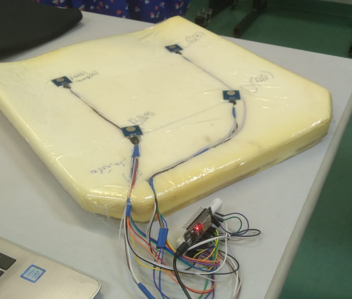

   
  Sistema de Monitoramento para Assentos de Cadeira de Roda

## Resumo do projeto

O projeto tem por objetivo apresentar um sistema de monitoramento de temperatura, em assentos de cadeiras de rodas, para auxiliar a prevenção de formação de úlceras causadas por pressão na região dos glúteos (sacral), permitindo a interação do cadeirante, com baixo custo.

## Relatórios

- [Relatório Técnico](./tecnico/)

- [Relatório do Projeto](./projeto/)

