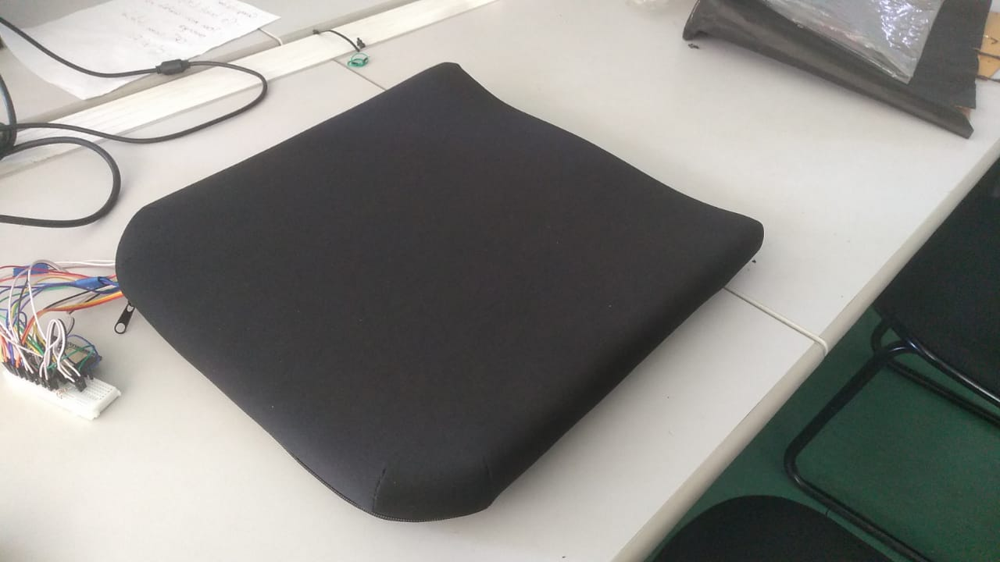

# Relatório do Projeto

**SMAC** - Sistema de Monitoramento para Assentos de Cadeira de Roda

 

## Introdução

Segundo o IBGE na Pesquisa Nacional de Saúde (PNS) de 2019, detalha que 7,8 milhões de habitantes apresentam deficiência física nos membros inferiores.
Estudos revelam sobre indivíduos que permanecem sentados ou deitados por períodos sem movimentação, sujeitos à pressão do corpo (massa x área) constante, têm a temperatura do microclima (Interface de umidade e temperatura, neste caso, entre o indivíduo e o assento) aumentada.
Este aumento de temperatura atinge níveis que proporcionam o amolecimento da pele, porém, este ajuste em aliviar a pressão e restabelecer a circulação sanguínea, é feito instintivamente por pessoas que tem o sistema sensorial em pleno funcionamento, até dormindo fazem a adequação para o conforto do corpo. 
Os cadeirantes, na sua maioria, têm a sensibilidade abaixo da cintura comprometida, assim, um sistema para monitorar esta região de maior pressão e avisar o momento para mudar de posição, será eficaz na prevenção de úlceras.

## Materiais e Métodos

### Materias

Um protótipo foi desenvolvido sobre um assento de espuma de poliuretano, dimensões 40 x 40 x 5 cm, com capa em tecido de malha 100% filamentos sintéticos de poliéster, com velcro para fixação na cadeira de rodas.
Usados 4 sensores de toque (presença) e 4 sensores de temperatura foram instalados na superfície do assento, mediante recortes na espuma, para alojamento dos dispositivos TTP223B (Sensor de Toque), DS18B20 (Sensor de Temperatura) e jumpers, ligados à uma placa ESP32 instalada em protoboard de 200 pontos, resultante do corte de uma placa de 400 pontos, para reduzir as dimensões e adequar à fixação no assento.

Figura 1 - Protótipo sem a capa

### Métodos

Testes de temperatura foram realizados em laboratório com um termômetro de líquido vermelho anexado ao sensor de temperatura. Produziu-se calor com um soprador térmico digital fixando temperatura em 40ºC na superfície do assento, a qual, foi equalizada e estabilizada com a leitura dos sensores DS18B20 após 10 minutos em cada um.
Com base no protocolo de enfermagem para prevenção de úlceras de decúbito, onde a cada 2 horas deve movimentar o paciente, o protótipo terá como limite para alerta 20 minutos se não houver movimentação no sensor de toque, visto a pressão do indivíduo sentado ser maior que o deitado. Um parâmetro de aviso, incialmente quando a temperatura do microclima atingir  37ºC (estado febril). 
Estes valores são pontos de partida para o cadeirante personalizar seus parâmetros com a avaliação do seu fisioterapeuta, visto as variáveis de temperatura de pele nas várias etnias, faixa etária, massa corporal e atividade do cadeirante.

Figura 2 - Recobrimento da espuma de poliuretano com a capa de matéria têxtil.

 

Figura 3 - Uso do soprador térmico direcionado ao termômetro sobre o ponto do sensor de temperatura.

 

## Resultados

O custo dos componentes eletrônicos é de aproximadamente R$ 100,00, os quais, são indicados para instalação no assento já existente.
O assento com poliuretano e capa de malha com velcro custou R$150,00, tem densidade 33 e permite cuidados com a capa de acordo com a informações do fabricante do tecido.
O sistema pode ser alimentado por “power bank” com porta USB.
É um produto usável, vestível, confortável, com visual “clean” sem alterar as características originais da cadeira de rodas.
 
## Conclusão

Com cem reais, podemos instalar estes sensores em assentos diversos de cadeiras de rodas, programá-los para alertar o usuário, que o contato com o assento tem temperatura inadequada ou ainda ficou de repouso sem se mexer.

## Referências bibliográficas

- [1] Pesquisa IBGE, Disponível em:
https://sidra.ibge.gov.br/pesquisa/pns/pns-2019

- [2] COLOPLAST, A/S. Biatain®, Úlceras Por Pressão: Prevenção e Tratamento. Humlebaek, Dinamarca, 2013. Disponível em:
https://www.coloplast.com.br/global/brasil/wound/cpwsc_guia_pu_a5_d7.pdf

- [3] VOLPINI, Mari et al. Sistema Computadorizado de Baixo Custo Para Prevenção de Úlceras de Pressão em Cadeirantes. XXIV Congresso Brasileiro de Engenharia Biomédica, Belo Horizonte/MG, Brasil, p.272-275, 2014. 
Disponível em: https://www.canal6.com.br/cbeb/2014/artigos/cbeb2014_submission_083.pdf

- [4] BERNARDES, Rodrigo Magri “Enfermeiro”. Recurso Educacional Sobre Prevenção e Manejo da Lesão por Pressão. Tese de Doutorado, Escola de Enfermagem da USP, Ribeirão Preto/SP, fevereiro/2020. Disponível em:
http://eerp.usp.br/feridascronicas/recurso_educacional_lp_1_3.html

- [5] SOARES, Rhea Silvia de Avila et al. Temperatura da Pele de Diferentes Áreas Corporais de Idosos sem Risco para Lesões por Pressão, Rev. Enfermagem UFSM, Santa Maria/RS, v10, p. 1-19, 2020. DOI: 10.5902/21797692Id41643, ISSN 2179-7692. Disponível em:
https://www.researchgate.net/publication/347343268_Temperatura_da_pele_de_diferentes_areas_corporais_de_de_de_de_idososidososidososidosos_sem_risco_sem_risco_sem_risco_sem_risco_paraparaparapara_lesoes_lesoes_lesoes_lesoes_por_pressaopor_pressaopor_pr

- [6]  SANTOS, Moelisa Queiroz dos. Perda da Integridade Tissular e da Pele Região Sacral: Sobrevida e Fatores Prognósticos da Mortalidade de Pacientes Críticos. Programa de Pós-Graduação da Escola de Enfermagem da Universidade Federal da Bahia. Salvador/BA, 2018. Disponível em:
https://repositorio.ufba.br/bitstream/ri/29541/1/Tese_Enf_Moelisa%20Queiroz%20dos%20Santos.pdf

- [7]  XSENSOR®, Technology Corporation. Monitoramento Contínuo da Pele em Cadeiras de Rodas, Calgary, Canadá, 2022. Disponível em:
https://pt-br.xsensor.com/solutions-and-platform/csm/wheelchair-seating

