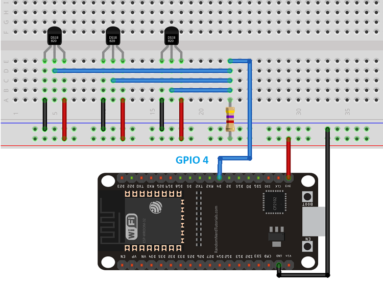
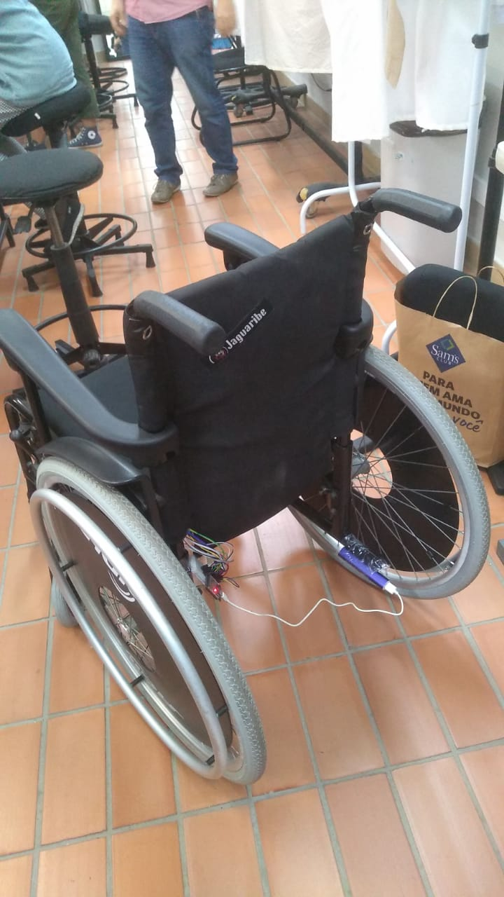
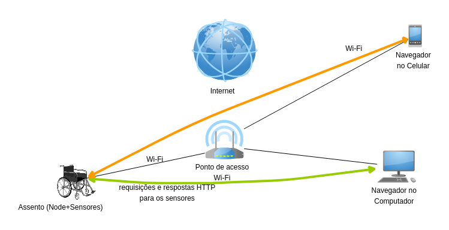
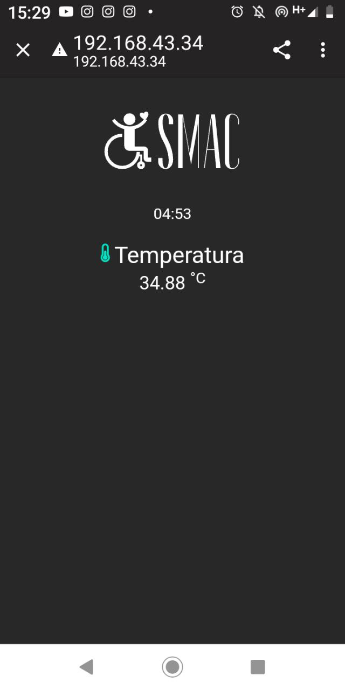
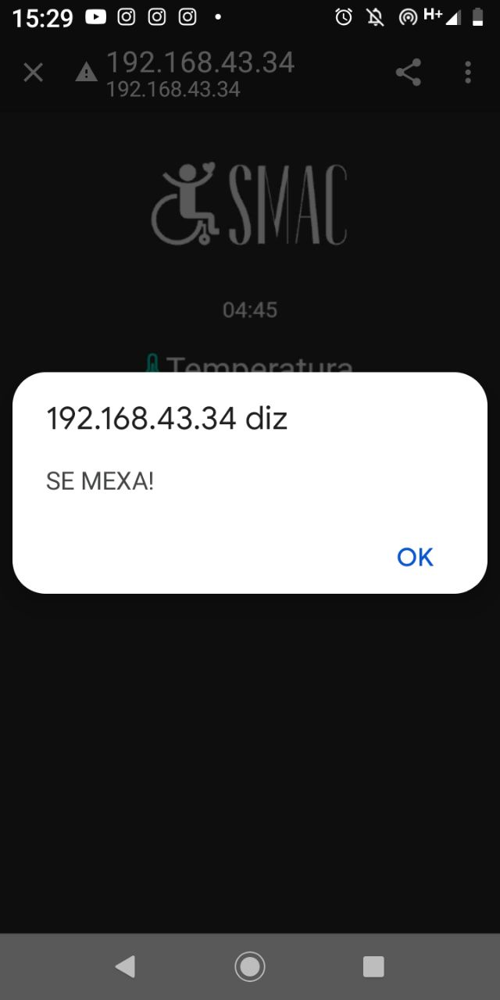
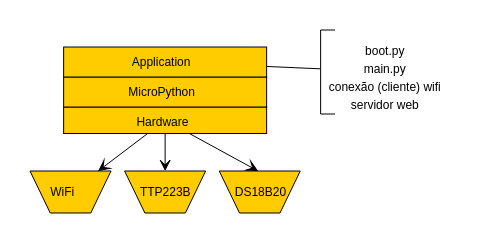

<p align="center">
  <br/>
  Sistema de Monitoramento para Assentos de Cadeira de Roda<br/>
  <i>:desktop_computer: Relatório técnico</i>
</p>
<br/>


Adicionar:
- Diagrama do circuito
- Explicação dos códigos

<p align="center">
  <br/>
</p>

## :wheelchair: Descrição

Na animação, o usuário está na porta 80 do endereço de IP do assento pelo navegador. Após ficar 20 minutos sentado na mesma posição, a página envia um alerta para ele se mexer e reinicia o cronômetro.

O dispositivo NodeMCU conecta-se ao wifi local e funciona como um servidor web. Quando os programas são iniciados, o IP é mostrado em algum programa que mostre a saída. Basta navegar para <IP>:80 no navegador para ver a página inicial, que possui a temperatura entre assento e a pessoa e o tempo no qual ela está sentada na mesma posição. 

Após passar 20 minutos na mesma posição ou a temperatura estar maior que 37° C, a página envia um alerta para que o usuário sente em outra posição. Caso ele sente em outra posição antes dos 20 minutos, o cronômetro é iniciado.


<br/>

### Lista de Materiais

| Quantidade | Nome | Link para referência |
| --- | --- | --- |
| 1 | ESP32 e cabo USB | https://www.baudaeletronica.com.br/placa-doit-esp32-bluetooth-e-wifi.html |
| 4 | Sensor de Toque Touch Capacitivo TTP223B | https://www.baudaeletronica.com.br/sensor-touch-capacitivo-ttp223b.html |
| 4 | Sensor de Temperatura Digital DS18B20 tipo TO92 | https://www.baudaeletronica.com.br/sensor-de-temperatura-digital-ds18b20.html |
| X | Jumpers variados | --- |
| 1 | Protoboard | --- |
| 1 | Resistor 100 ohms | --- |
| 1 | Fonte de alimentação - PowerBank | https://www.americanas.com.br/produto/2706391331 |

**Nota**: Para fazer o acoplamento na almofada, uma protoboard de 400 pontos foi cortada ao meio, ocupando menos espaço.

### Conexões

| Componente | Pino da placa |
| --- | --- |
| Sensor de Toque A | 21 |
| Sensor de Toque B | 19 |
| Sensor de Toque C | 23 |
| Sensor de Toque D | 22 |
| Sensores de temperatura | 4 |

**Nota**: O sensor de temperatura DS18B20 permite que sejam adicionados múltiplos sensores num mesmo pino, economizando conexões da placa. Para utilizá-lo, é necessário utilizar o resistor de 100 ohm seguindo o diagrama abaixo.

<p align="center">
Figura 1 - Conexão de múltiplos sensores DS18B20 no mesmo pino <br/>
  <br/>
</p>

<br/>

## :electric_plug: Montagem do dispositivo físico

Faça quatro furos de estilete na almofada. Em cada furo, adicione um sensor de temperatura e um sensor de toque. 

<p align="center">
Figura 2 - O circuito no assento sem capa<br/>
  <br/>
</p>

O circuito segue as conexões listadas no tópico acima.

Figura 3 - Diagrama do circuito

<!-- Colocar diagrama do sistema aqui -->

<br/>

## :desktop_computer: Funcionamento do sistema

Para rodar o sistema, é necessário:

- Micropython instalado na placa ([tutorial](https://github.com/FNakano/CFA/tree/master/programas/Micropython))

- ampy para passar os arquivos para a placa ([tutorial](http://pettec.unifei.edu.br/wp-content/uploads/2020/12/PET_TEC_tutorial_micropython.pdf))

- _OPCIONAL:_ picocom para ver as saídas da placa ([tutorial](http://pettec.unifei.edu.br/wp-content/uploads/2020/12/PET_TEC_tutorial_micropython.pdf))

São três os arquivos utilizados pelo sistema<br/>
```code
├── boot.py
├── main.py
├── index.html
``` 
<br/>

A explicação de como o programa foi feito e do que cada parte de código faz pode ser encontrada no [README.md do diretório "codigo"](./codigo)

<br/>
Para executar o SMAC, é necessário passar os três arquivos (`boot.py`, `main.py`, `index.html`) para a placa. Após isso, a placa enviará o endereço IP local para a saída em sua porta 80 (padrão web). 

<br/>

É possível acessá-lo por qualquer dispositivo que **esteja na mesma rede**, basta colocar o IP de saída no navegador. 
O circuito deve sair por trás do assento e ser conectado com um powerbank.

<p align="center">
  Figura 4 - Conexão do circuito à cadeira de rodas <br/>
  <br/>
</p>

<br/>

## :keyboard: Arquitetura e organização

<p align="center">
Figura 5 - Feito usando yEd, [arquivo-fonte da figura](https://raw.githubusercontent.com/JadnoABS/digitalLocker/main/docs/Rede.graphml) por Fábio Nakano:<br/>
  <br/>
</p>

O dispositivo SMAC se conecta ao ponto de acesso wi-fi como um cliente, obtendo um endereço de IP local. Outros dispositivos conectados na mesma rede local podem navegar para o endereço IP (fazendo uma requisição HTTP) e receberão como resposta a [página web](./codigo/index.html).

A página faz novas requisições a cada 3 segundos após ser carregada. Uma requisição (GET /pegar_temp) se comunica com os sensores DS18B20 e envia a temperatura atual, atualizando-a na página. Outra requisição (GET /pegar_mexer) verifica se houve alguma mudança na leitura dos 4 sensores de toque. Caso sim, a aplicação considera que houve mudança de posição e reinicia o cronômetro que está no lado do servidor da página.

Após terminar o tempo do cronômetro ou a temperatura ser maior que 37, a página envia um alerta para o usuário se mexer.

<p align="center"></br>
  Figuras 6 e 7 - Interface web
   <br/>
</p>


O dispositivo pode ser visto como a interconexão do circuito do assento com o modem wifi (embutido no controlador) e o controlador. A interface entre o programador e o hardware do controlador é feita através de Micropython. 
- O programa `boot.py` contém os comandos para conectar ao wifi (como cliente)
- `main.py` contém os comandos para funcionar como um servidor web e as requisições
- Por fim, `index.html` é a página que é carregada pelo servidor web em main.py. 

<p align="center">
Figura 8- Feito usando yEd, [arquivo-fonte da figura](https://raw.githubusercontent.com/JadnoABS/digitalLocker/main/docs/layerModel.graphml) por Fábio Nakano:</br>
  <br/>
</p>

<br/>

## :computer_mouse: Funcionamento dos sensores

### Sensor de temperatura DS18B20 tipo TO92

O DS18B20 é um sensor de temperatural digital que realiza medições na faixa de -55°C até 125°C em graus celsius sem a necessidade de um componente externo para isso. O sensor utiliza o protocolo One-Wire, ou seja, sua comunicação é feita por um único fio de dados (além do VCC e GND), além de possuir um código ID próprio de 64 bits, permitindo a conexão de até 127 sensores num mesmo barramento com endereços diferentes, poupando espaço do projeto. (Especificação técnica: https://www.curtocircuito.com.br/datasheet/sensor/temperatura_DS18B20.pdf)

Este sensor posui precisão de mais ou menos 0,5°C na faixa de medição de -10°C até 85°C. Suas principais características são: 
- Chip: DS18B20;
- Tensão de operação: 3 a 5VDC;
- Consumo: 1,5mA;
- Comunicação: 1 fio;
- Faixa de medição: -55° a 125°C;
- Resolução de saída: 9 a 12 bits (programável);
- Tempo de conversão: 750ms (12-bits);
- Precisão: ±0,5 entre -10°C e 85°C;


### Sensor de toque TTP223B

O sensor digital de toque TTP223B é de simples funcionamento, mudando o sinal quando há um toque. Sua tensão de operação é entre 2-5, 5V; a saída de estado alto é 0,8V e baixo de 0,3 V. O tempo de resposta é de 220 ms (em estado baixo) e 60 ms (em estado alto), contando com as dimensões de 24 x 24 x 7,2 mm (Especificação técnica: https://files.seeedstudio.com/wiki/Grove-Touch_Sensor/res/TTP223.pdf)

<br/>

## :bookmark_tabs: Referências

- [7]  XSENSOR®, Technology Corporation. Monitoramento Contínuo da Pele em Cadeiras de Rodas, Calgary, Canadá, 2022. Disponível em:
https://pt-br.xsensor.com/solutions-and-platform/csm/wheelchair-seating


<!-- https://randomnerdtutorials.com/esp32-esp8266-micropython-web-server/
https://docs.micropython.org/en/latest/esp8266/tutorial/network_tcp.html#http-get-request -->

<br/>

## :woman_technologist: Colaborar usando github (meta)

<!-- A maneira indicada pelo mantenedor do github para colaborar com projetos hospedados nele é através de bifurcação e pull request: https://stackoverflow.com/questions/32750228/how-to-contribute-to-someone-elses-repository.

É possível ser colaborador do projeto e fazer pull/push (https://stackoverflow.com/questions/42619669/how-to-make-branch-from-friends-repository), mas isto pode gerar confusão (quando fiz isso com outra pessoa eu a confundi e ela acabou reiniciando o repositório - `git init` - não foi um bom resultado).

Quando procurei essa informação, nas postagens, encontrei um material interessante sobre a organização (interna) do git: https://stackoverflow.com/tags/git/info

Sobre bifurcação: https://docs.github.com/pt/get-started/quickstart/fork-a-repo, https://docs.github.com/en/pull-requests/collaborating-with-pull-requests/working-with-forks/about-forks. -->

### Features implementadas

- [x] Identificação da mudança de posição na cadeira
- [x] Cronômetro que reinicia quando há uma mudança de posição na cadeira
- [x] Identificação da temperatura entre assento e pessoa
- [x] Alerta quando passa de 37°C ou quando passa de 20 minutos sentado na mesma posição

### Features para incrementar no projeto

- [ ] Cronômetro do lado do servidor
- [ ] Conexão à internet sem precisar mexer no código em boot.py
- [ ] Possibilidade do usuário configurar o tempo e a temperatura para os alertas
- [ ] Aplicação rodar em segundo plano para o usuário não precisar ficar com a página aberta

