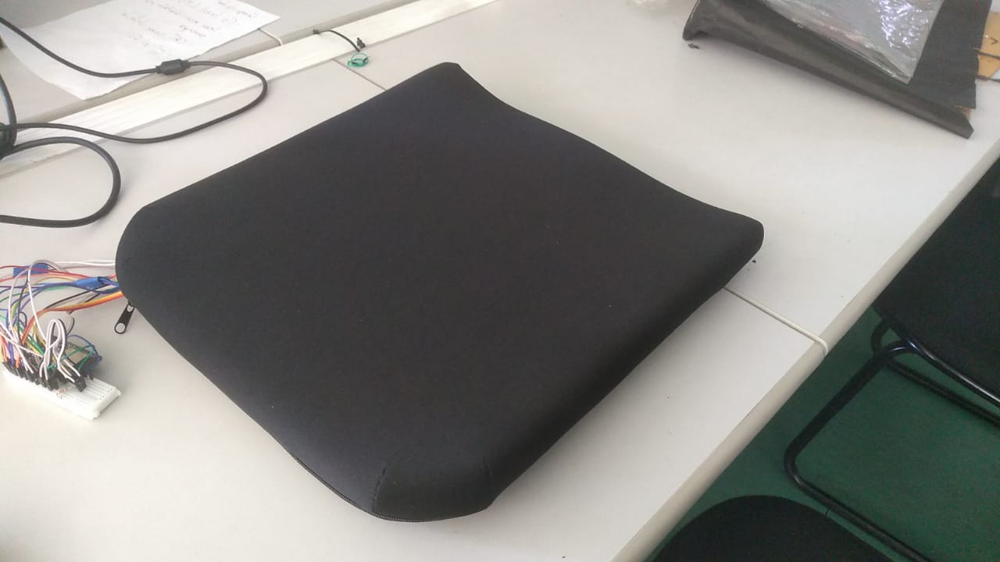

# SMAC

Sistema de Monitoramento para Assentos de Cadeira de Roda

 

## Descrição

Na animação, a fechadura foi acessada em 192.168.0.11:3000. Digitar esse endereço (número) na barra de endereço do navegador faz este mostrar a página do digitalLocker.

Clicar no botão OFF para abrir, clicar no botão ON para fechar.

O NodeMCU conecta-se ao wifi local e funciona como um servidor web. Quando o programa é iniciado, o IP é mostrado no REPL ou na IDE que você estiver usando. Navegar para <IP>:3000 o que mostra a página com dois botões. O programa executado pelo Node é `digitalLocker.py`.

### Lista de Materiais

| Quantidade | Nome | Link para referência |
| --- | --- | --- |
| 1 | ESP32 e cabo USB | https://www.baudaeletronica.com.br/placa-doit-esp32-bluetooth-e-wifi.html |
| 4 | Sensor de Toque Touch Capacitivo TTP223B | https://www.baudaeletronica.com.br/sensor-touch-capacitivo-ttp223b.html |
| 4 | Sensor de Temperatura Digital DS18B20 | https://www.baudaeletronica.com.br/sensor-de-temperatura-digital-ds18b20.html |
| X | Jumpers variados | --- |
| 1 | Protoboard | --- |
| 1 | Resistor 100 ohms | --- |
| 1 | Fonte de alimentação - PowerBank | https://www.americanas.com.br/produto/2706391331 |

**Nota**: Para fazer o acoplamento na almofada, uma protoboard de 400 pontos foi cortada ao meio, ocupando menos espaço.

### Conexões

| Componente | Pino da placa |
| --- | --- |
| Sensor de Toque A | 21 |
| Sensor de Toque B | 19 |
| Sensor de Toque C | 23 |
| Sensor de Toque D | 22 |
| Sensores de temperatura | 4 |

**Nota**: O sensor de temperatura DS18B20 permite que sejam adicionados múltiplos sensores num mesmo pino, economizando conexões da placa. Para utilizá-lo, é necessário utilizar o resistor de 100 ohm seguindo o diagrama abaixo.

Figura 1 - Conexão de múltiplos sensores DS18B20 no mesmo pino

 

## Montagem do dispositivo físico

Fazer as conexões listadas, configurar, transferir e executar `digitalLocker.py` no Node e navegar para o IP indicado pelo Node.

## Arquitetura e organização

Figura 1 - Feito usando yEd, arquivo-fonte da figura em /docs/Rede.graphml:

O dispositivo (digitalLocker) conecta-se ao ponto de acesso wi-fi como um cliente wi-fi e obtém um endereço IP local. Através do navegador, outros dispositivos podem navegar (fazer requisições HTTP) para o endereço IP e receberão como resposta uma página web contendo dois botões. Clicar nos botões causa o envio de uma nova requisição (HTTP:GET) que, quando recebida pelo digitalLocker, causa o giro do servo motor e o envio da resposta para o navegador.

O dispositivo pode ser visto como a interconexão do motor com o modem wifi (embutido no controlador) e o controlador. A interface entre o programador e o hardware do controlador é feita através de Micropython. O programa `digitalLocker.py` contém os comandos para conectar ao wifi (como cliente), funcionar como um servidor web e controlar o motor. Uma ilustração é apresentada na figura 2.

Figura 2- Feito usando yEd, arquivo-fonte da figura em /docs/layerModel.graphml:

## Explica como usar o programa

Para executar `digitalLocker.py` no Node, este deve estar carregado com Micropython. Instruções sobre como carregar Micropython neste [link externo](https://github.com/FNakano/CFA/tree/master/programas/Micropython). Depois de carregar, ou transferir o programa ou executá-lo usando, por exemplo WebREPL (instruções neste [link externo]()https://github.com/FNakano/CFA/tree/master/programas/Micropython/webREPL), ou o método que preferir. No exemplo, uso Thonny e envio `digitalLocker.py` para o Node. No arquivo é definida a função `startServer()`. Desta forma, no REPL, digitar `import digitalLocker` para importar a função e digitar `digitalLocker.startServer()` para iniciar o servidor. Isto é mais cômodo que executar os comandos um por um, seja digitando, seja com copy-paste.

## Funcionamento dos sensores

### Sensor de temperatura DS18B20

### Sensor de toque TTP223B

O servomotor é um motor em que o eixo gira menos de uma volta e o ângulo de giro do eixo pode ser controlado. O motor específico desta montagem permite ângulos entre zero e 180 graus (especificação técnica: http://www.datasheet-pdf.com/PDF/SG90-Datasheet-TowerPro-791970). Este motor recebe energia pelos fios marrom (GND) e vermelho (VCC). A tensão de alimentação pode ser algo entre 4V e 7.2V. Nesta montagem será 6V. O fio laranja conduz o sinal de controle para o motor.

O sinal de controle é um trem de pulsos de 20ms (50Hz), com duração do patamar em nível 1 variando entre 1 e 2ms. O ângulo de giro é proporcional à duração do patamar em nível 1. Por exemplo, com pulsos de 1,5ms durante o intervalo de 20ms, o ângulo de giro é de 90 graus (aproximadamente); com pulsos de 2ms, o ângulo é de 180 graus (https://www.engineersgarage.com/servo-motor-sg90-9g-with-89c51-microcontroller/). Esse tipo de sinal pertence à categoria dos sinais em *Pulse Width Modulation* (PWM).

Um sinal PWM é especificado pela frequência e pelo ciclo de carga (*duty-cycle*). O ciclo de carga é o percentual do tempo em que o sinal fica em nível 1 comparado com o período todo do sinal. Por exemplo, um sinal de 50Hz tem período de 20ms. Se o ciclo de carga for 20%, durante 20% desse período (ié 4ms), o sinal fica em nível 1 e o restante do tempo (16ms) fica em nível zero. Se o ciclo de carga for 50%, o patamar 1 dura 10ms e o patamar zero dura 10ms.

## Explica como o programa foi feito

São três os arquivos utilizados pelo sistema
├── boot.py
├── main.py
├── index.html
A explicação de cada um deles pode ser encontrada no [README.md do diretório "codigo"](./codigo)

## Referências

https://randomnerdtutorials.com/esp32-esp8266-micropython-web-server/
https://docs.micropython.org/en/latest/esp8266/tutorial/network_tcp.html#http-get-request

## Colaborar usando github (meta)

A maneira indicada pelo mantenedor do github para colaborar com projetos hospedados nele é através de bifurcação e pull request: https://stackoverflow.com/questions/32750228/how-to-contribute-to-someone-elses-repository.

É possível ser colaborador do projeto e fazer pull/push (https://stackoverflow.com/questions/42619669/how-to-make-branch-from-friends-repository), mas isto pode gerar confusão (quando fiz isso com outra pessoa eu a confundi e ela acabou reiniciando o repositório - `git init` - não foi um bom resultado).

Quando procurei essa informação, nas postagens, encontrei um material interessante sobre a organização (interna) do git: https://stackoverflow.com/tags/git/info

Sobre bifurcação: https://docs.github.com/pt/get-started/quickstart/fork-a-repo, https://docs.github.com/en/pull-requests/collaborating-with-pull-requests/working-with-forks/about-forks.

### Features implementadas

### Features para incrementar no projeto
